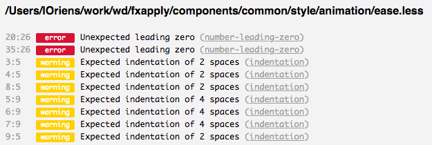

# Stylelint Formatter HTML

Generate HTML Page to show results of stylelint.



## Usage

install

```sh
npm i stylelint-formatter-html -D
```

call with stylelint

```sh
stylelint file.css --custom-formatter node_modules/stylelint-formatter-html > result.html
```

## Todo

- folding results of each file

